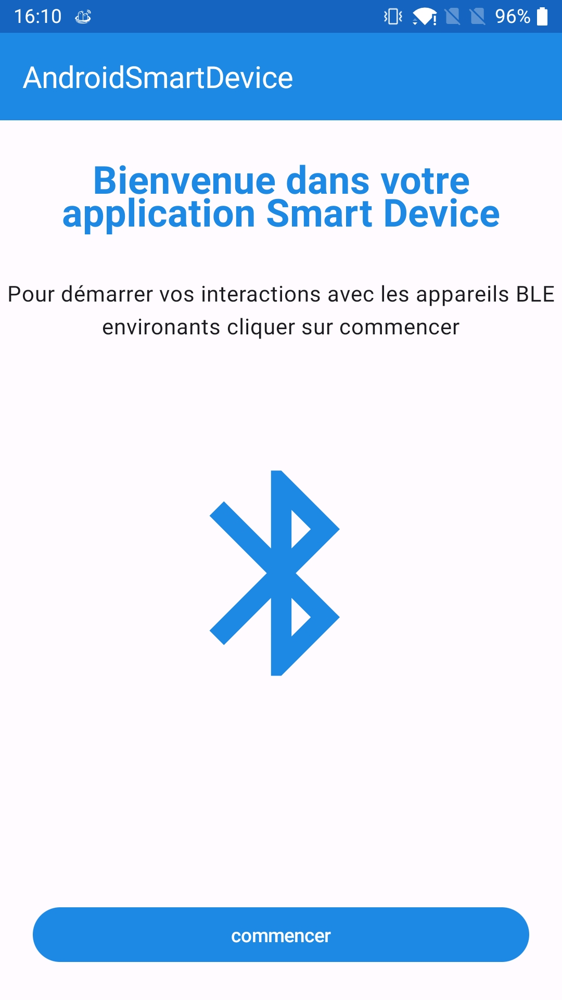
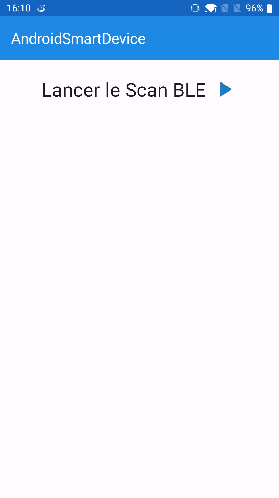
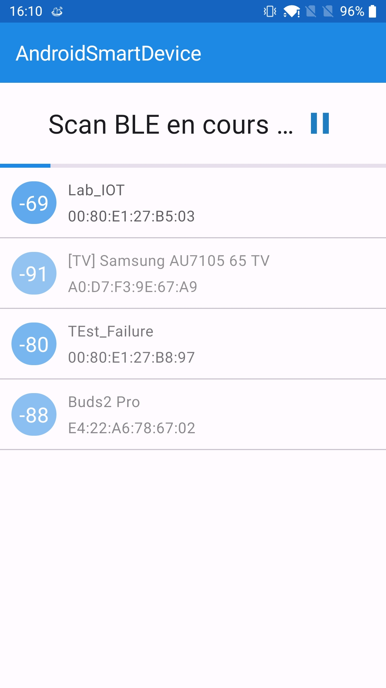
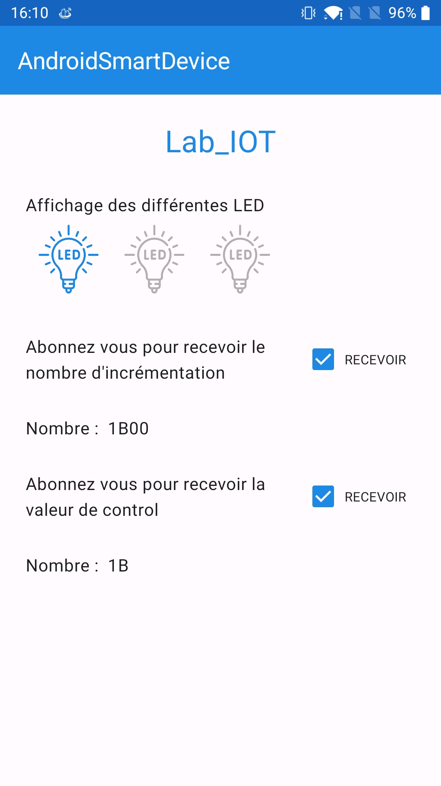

# AndroidSmartDevice

Ce projet est une application support au cours de développement mobile BLE enseigné à l'ISEN Toulon.
Il permet notamment de comprendre les concepts de :

- Gérer les permissions pour accéder au Bluetooth
- Scan des appareils BLE environnant
- Connexion et récupération des services/caractéristiques
- Lecture et écriture dans une caractéristique
- Abonnement aux notifications de l'appareil

 

  
  
  
  

